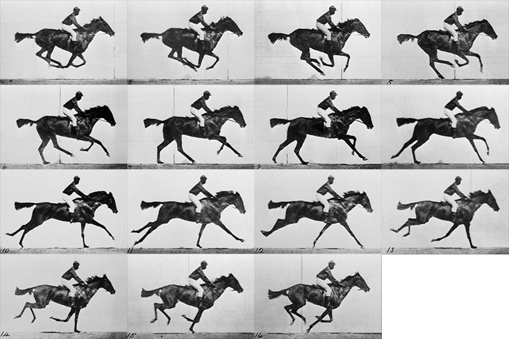
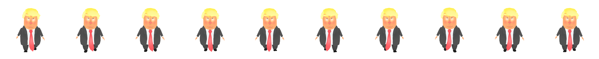
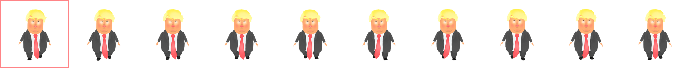

@title    Animation Sprite Sheet
@type     doc
@order    1
@abstract animation image par image
@image    582-215MO/css/animation-sprite-sheet/images/icon.png

Pensez au cinéma 📽️. Une pellicule contient de nombreuses images 🎞️. Chaque image représente une étape dans un mouvement.

Pour voir un mouvement continu, ces 15 images doivent s'afficher dans un intervalle régulier. Plus le nombre d'images est élevé, plus le mouvement est fluide.



Les animations de type sprite sheet fonctionnent sur le même principe.

---

## Fichier image

Il est nécessaire d'avoir une sprite sheet regroupant toutes les images clés _(keyframes)_ constituant l'animation. Toutes les images clés doivent avoir la même dimension et être placées à une distance équivalente.

Par exemple, chaque image clé constituant l'animation de Donald Trump mesure 250px de large par 250px de haut. Puisque la sprite sheet est constituée de dix images clés, elle mesure donc 2500px de large pour une hauteur de 250px.





Les images sources ont parfois besoin d'être redimensionnées ou recadrées avant d'être utilisées pour générer une sprite sheet. Dans ce cas, l'option la plus efficace est d'utiliser une Action Photoshop.

---

## Animation

Si nous pouvions _"flasher"_ chaque image à intervalle régulier, nous pourrions voir l'animation.

Il faut d'abord créer un élément HTML dont la dimension correspond à celle d'une image clé. Dans cet exemple, 250px par 250px. Et y ajouter notre sprite sheet en background-image.

Ainsi, seule la première image clé devrait être visible.



Il faut ensuite animer la propriété `background-position` de sorte que la sprite sheet se déplace vers la gauche et que toutes les images clés défilent une à la suite de l'autre.

Dans cet exemple, nous déplaçons donc la sprite sheet de sa largeur, soit `-2500px`.



Malheureusement, l'effet n'est pas convaincant puisqu'il y a une interpolation sur la propriété `background-position`.

Il est néanmoins possible d'ajuster la propriété [animation-timing-function](https://developer.mozilla.org/fr/docs/Web/CSS/animation-timing-function) afin de remédier à cette situation. Plutôt que de lui donner une valeur telle que `ease` ou `linear`, il est possible de lui passer la fonction `steps()`. Cette dernière permet de spécifier le nombre d'étapes devant constituer l'animation.

Par exemple, nous avons dix images clés constituant l'animation de Donald Trump. Il faudra donc spécifier `steps(10)`.





---

## Exercices




